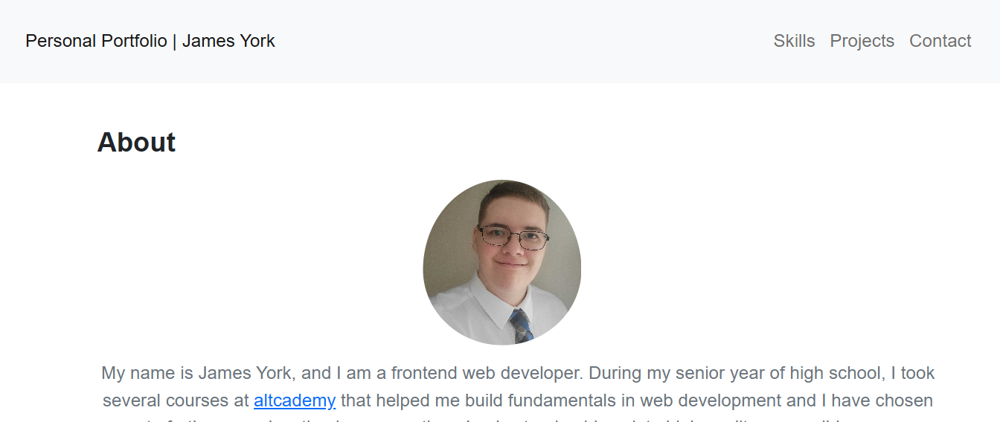
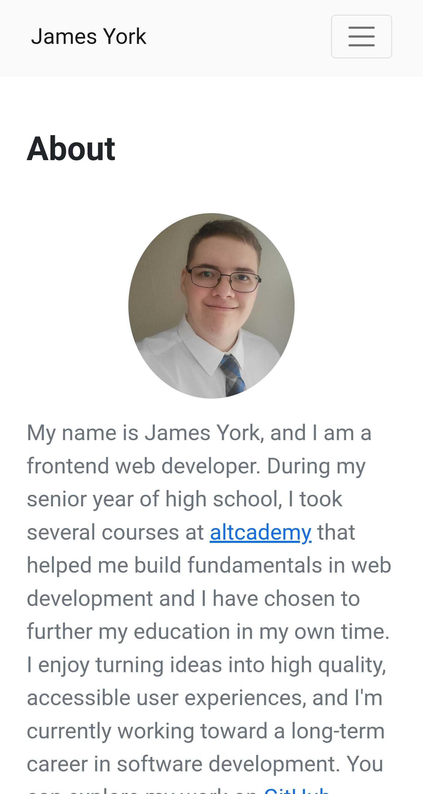

# Personal-Portfolio: James York
[Live Page](https://james-york2008.github.io/Personal-Portfolio/)






## Run Locally

1. **Clone the repository:**
```bash
git clone https://github.com/james-york2008/Personal-Portfolio
cd Personal-Portfolio
```

2. **Start a local server:**
**Using Python:**
```bash
python -m http.server 8000
```

3. **View the app:**
Open your browser and navigate to `http://localhost:8000`


## Overview

This repository contains my personal frontend developer portfolio, designed to highlight my technical skills and featured projects. It includes an introduction, an interactive skills section, project showcases with links to live applications and source code, and a contact section. 


## Features

- **Introduction:** Highlights my professional background
- **Interactive Skills Section:** On desktop, the skills section is expandable
- **Project Showcases:** Select projects are displayed alongside related links and images
- **Contact Section:** Displays my Email, GitHub, and LinkedIn links


## Tech Stack

- **Structure:** HTML5
- **Styling:** Bootstrap 5.1.1 & custom CSS3
- **Logic:** JavaScript


## Challenges Faced and Lessons Learned

### Code Improvements
- Replaced old `.jpg` and `.png` assets with modern `.webp`s and later re-encoded them to truly reduce file size
- Organized inconsistent media query usage to improve readability

### Heading Structure
- Reworked an old `h4 -> h5 -> h6` heading structure to a more accessible `h1 -> h2 -> h3`
- Accidentally edited a Bootstrap CDN link using global multi cursor editing and fixed it by pulling the original link from the GitHub repository

## Potential Future Improvements:
- Add project filtering
- Introduce a dark mode
- Perform various accessibility tests and implement the findings
- Optimize images
- Create a custom 404 page for error recovery